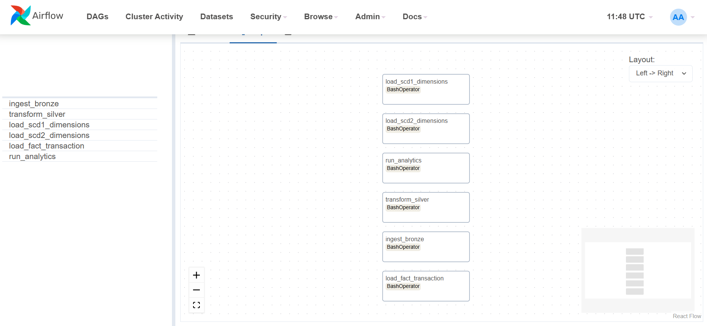
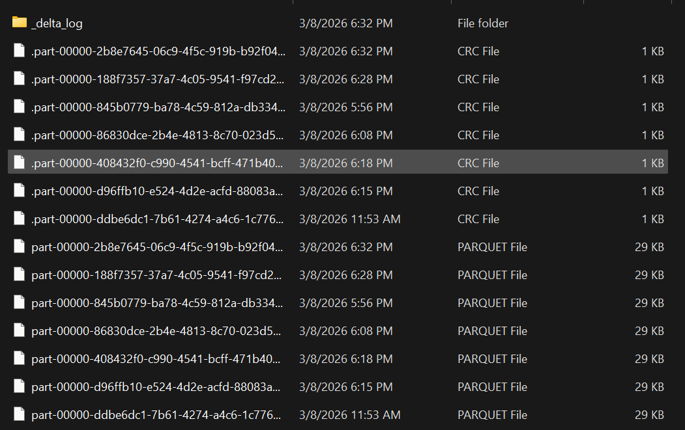
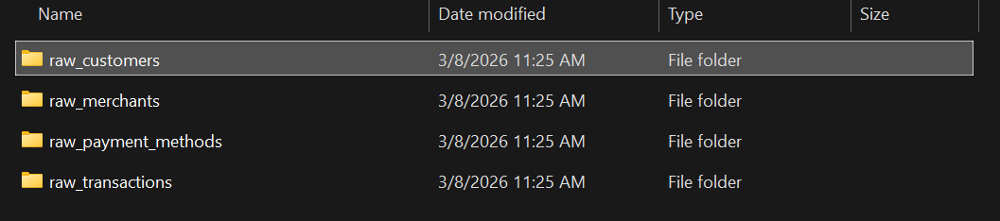
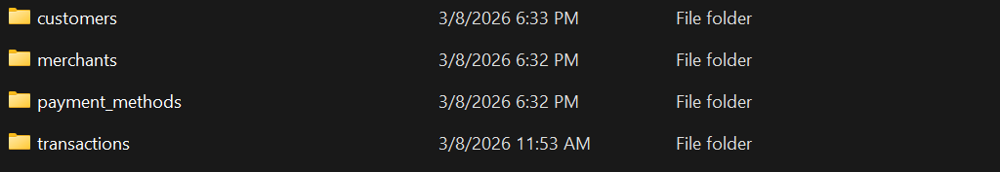
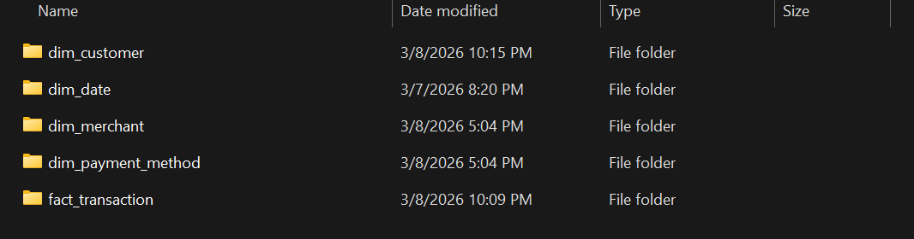
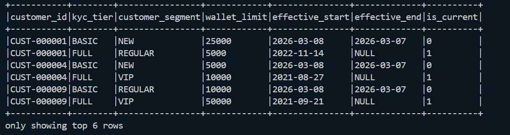
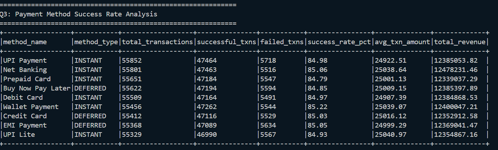
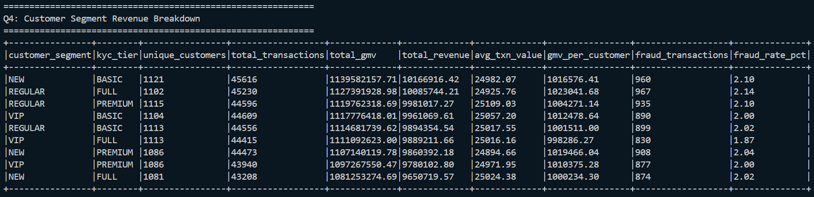

# 💳 PayFlow DWH — Payment Transaction Lakehouse

> A production-grade Data Warehouse built on the **Medallion Architecture** 
> using PySpark, Delta Lake, and Apache Airflow. 
> Simulates a real-world UPI/payment processing pipeline 
> with 500K daily transactions.

---

## 🏗️ Architecture
```
Raw CSVs (Faker)
      ↓
  [BRONZE]  — Raw Delta tables, all strings, full audit trail
      ↓
  [SILVER]  — Typed, cleaned, validated Delta tables
      ↓
  [GOLD]    — Star Schema (Fact + Dimensions)
      ↓
  [AIRFLOW] — Orchestrated daily at 2 AM
```

---

## 🛠️ Tech Stack

| Tool | Version | Purpose |
|------|---------|---------|
| PySpark | 3.5.0 | Distributed data processing |
| Delta Lake | 3.1.0 | ACID transactions + MERGE |
| Apache Airflow | 2.8.0 | Pipeline orchestration |
| Python | 3.11.9 | Core language |
| Docker | latest | Airflow containerization |
| Faker | 22.0.0 | Synthetic data generation |

---

## 📊 Star Schema
```
                    dim_date
                       |
dim_customer ——— fact_transaction ——— dim_merchant
                       |
               dim_payment_method
```

### Fact Table
- **fact_transaction** — Grain: one row per payment transaction
  - Measures: txn_amount, platform_fee, cashback_amount, net_revenue
  - 500,000 rows partitioned by txn_year/txn_month

### Dimension Tables
| Table | SCD Type | Rows | Notes |
|-------|----------|------|-------|
| dim_customer | Type 2 | 11,500 | KYC tier history tracked |
| dim_merchant | Type 1 | 1,000 | Latest values only |
| dim_payment_method | Type 1 | 10 | Static reference data |
| dim_date | Static | 4,748 | 2018–2030 calendar |

---

## 🔄 Pipeline Flow
```
1. ingest_bronze     — CSV → Delta (all strings)
        ↓
2. transform_silver  — Type cast, clean, validate
        ↓
3. load_scd1_dims    — dim_merchant, dim_payment_method
        ↓
4. load_scd2_dims    — dim_customer (with history)
        ↓
5. load_fact         — fact_transaction (point-in-time join)
        ↓
6. run_analytics     — 5 business queries
```

---

## 📸 Screenshots

### Airflow DAG
<!-- Add screenshot of Airflow UI showing DAG graph -->


### Parquet files saved locally
<!-- Add screenshot of successful DAG run -->


### Bronze Layer
<!-- Add screenshot of bronze tables -->


### Silver Layer
<!-- Add screenshot of silver tables -->


### Gold Layer — Star Schema
<!-- Add screenshot of gold tables -->


### SCD Type 2 — Customer History
<!-- Add screenshot showing dim_customer with historical rows -->


### Analytics Queries Output
<!-- Add screenshot of query results -->


---

## 🚀 How to Run

### Prerequisites
- Python 3.11.9
- Java 17
- Docker Desktop

### Setup
```bash
# Clone repo
git clone https://github.com/saurabh9893/payflow-dwh.git
cd payflow-dwh

# Create virtual environment
py -3.11 -m venv venv
venv\Scripts\activate

# Install dependencies
pip install -r requirements.txt
pip install -e .
```

### Generate Data
```bash
python scripts/generate_dim_date.py
python scripts/generate_data.py
```

### Run Pipeline Manually
```bash
python src/ingestion/bronze_loader.py
python src/silver/silver_transform.py
python src/gold/dim_merchant_scd1.py
python src/gold/dim_customer_scd2.py
python src/gold/fact_loader.py
python sql/analytics/business_queries.py
```

### Run via Airflow
```bash
docker-compose up airflow-init
docker-compose up -d
# Open http://localhost:8080
# Trigger payflow_dwh_pipeline DAG
```

---

## 💡 Key Concepts Demonstrated

- **Medallion Architecture** — Bronze/Silver/Gold separation of concerns
- **SCD Type 1** — dim_merchant category updates with Delta MERGE
- **SCD Type 2** — dim_customer KYC tier history with point-in-time joins
- **Delta Lake MERGE** — Upsert logic with record hash change detection
- **Star Schema** — Fact + dimension design for analytical queries
- **Idempotency** — Pipeline safe to re-run without duplicates
- **Data Quality** — NULL key detection, type validation, deduplication
- **Partitioning** — fact_transaction partitioned by txn_year/txn_month

---

## ⚠️ Known Limitations

- Faker data generates some transactions before customer creation date
  resulting in ~20% NULL customer_key in fact_transaction.
  In production, source systems enforce referential integrity.
- Pipeline runs in local Spark mode — not cluster mode.
  Designed for portfolio demonstration, not production scale.

---

## 👤 Author

**Saurabh**  
Data Engineer  
[GitHub](https://github.com/saurabh9893) | 
[LinkedIn](https://linkedin.com/in/sauraxh)

